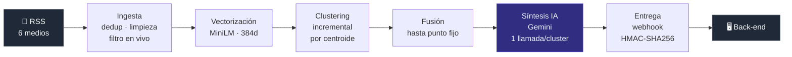

# 🤫 Sin Ruido — Motor de noticias

[](https://github.com/noticias-sin-ruido/motor-noticias/actions/workflows/ci.yml)


[](LICENSE)

**Lee las noticias de varios medios, detecta cuáles cubren el mismo hecho y escribe una síntesis neutral que compara cómo lo contó cada uno.**

El problema no es la falta de información, es el ruido: seis medios publican la misma noticia y ninguno dice exactamente lo mismo. Este motor agrupa esa cobertura por similitud semántica, separa el hecho en sus distintos ángulos y produce, para cada uno, un resumen objetivo más una **comparativa explícita de qué destacó, qué omitió y qué citó cada medio**. La salida se entrega a un back-end por webhook firmado, con tópicos, subtópicos y copy listo para publicar en redes.

Proyecto propio, listo para desplegar, con la entrega al back-end verificada punta a punta contra un receptor real.

---

## El pipeline



Corre solo cada 15 minutos con un scheduler embebido, y cada paso tiene además su endpoint manual. **Un paso que falla no frena a los siguientes**: todos son idempotentes, así que la corrida siguiente retoma donde quedó.

Reglas que definen el producto:

- Un cluster necesita **2 medios distintos** para publicarse. Sin dos voces no hay enfoques que comparar.
- La unidad que se publica **no es el cluster sino el ángulo**. Un mismo hecho produce varias síntesis (el hecho, sus consecuencias, las reacciones), porque el clustering agrupa por tema y solo leyendo los textos se los puede separar.
- La descomposición en ángulos **se congela** en la primera síntesis: las re-síntesis actualizan o agregan, nunca reparten de nuevo. Es lo que hace que el `id` sirva como clave de idempotencia para el back-end.

---

## Qué produce: un ejemplo real

Tres medios cubrieron el mismo anuncio de YPF. Hasta el titular difiere entre ellos —US$51.000 millones contra US$50.000 millones— y el motor los unificó igual:

| Medio | Titular original |
|---|---|
| La Nación | *Un proyecto por US$51.000 millones impulsado por YPF solicitó la adhesión al RIGI* |
| TN | *YPF pidió sumarse al RIGI con un proyecto de US$50.000 millones para exportar gas licuado de Vaca Muerta* |
| El Cronista | *YPF presentó su proyecto de GNL al RIGI por u$s 51.000 millones: qué obras abarca* |

Esto es lo que salió, tal cual se lo entregó al back-end:

```json
{
  "version": 1,
  "evento": "sintesis.actualizada",
  "sintesis": {
    "id": 143,
    "titulo": "YPF solicitó la adhesión al RIGI por un proyecto de GNL de 51.000 millones de dólares",
    "resumen": "YPF y sus socios presentaron la solicitud para incluir el proyecto Argentina LNG en el Régimen de Incentivo a las Grandes Inversiones, con una inversión total estimada en 51.000 millones de dólares para producir y exportar gas natural licuado.",
    "puntos_clave": [
      "Inversión estimada en 51.000 millones de dólares",
      "Presentación ante el RIGI",
      "Objetivo de exportar gas natural licuado"
    ],
    "topicos": ["economia", "politica"],
    "subtopicos": ["negocios"],
    "fecha_generacion": "2026-08-14T03:01:53Z",
    "publicacion_redes": {
      "resumen": "YPF solicitó la adhesión al RIGI para su proyecto de gas natural licuado con una inversión de 51.000 millones de dólares.",
      "hashtags": ["ypf", "rigi", "gnl", "economia"]
    }
  },
  "hecho": { "id": 344, "abierto": false },
  "comparativa": [
    {
      "medio": { "id": 2, "nombre": "El Cronista" },
      "destaco": "El monto total de la inversión y la superación de los proyectos ya aprobados en el régimen.",
      "omitio": "Detalles sobre competidores en el mercado de GNL.",
      "cita": "YPF concretó el mayor anuncio de inversión de la historia y presentó a su proyecto Argentina LNG para ser incluido dentro del Régimen de Incentivo a las Grandes Inversiones (RIGI)."
    },
    {
      "medio": { "id": 1, "nombre": "La Nación" },
      "destaco": "El impacto en la balanza comercial y el ingreso de divisas para el país.",
      "omitio": "Menciones específicas sobre competidores como Southern Energy.",
      "cita": "Argentina LNG presentó la solicitud de adhesión al Régimen de Incentivo para Grandes Inversiones (RIGI) para el desarrollo de su proyecto integrado de producción y exportación de gas natural licuado."
    },
    {
      "medio": { "id": 4, "nombre": "TN" },
      "destaco": "Los detalles de la infraestructura de transporte y la competencia con otros proyectos del sector.",
      "omitio": "Cifras detalladas sobre financiamiento inmediato con JP Morgan.",
      "cita": "YPF presentó este jueves ante el Régimen de Incentivo para Grandes Inversiones (RIGI) una iniciativa de exportación de gas natural licuado de Vaca Muerta que demandará una inversión estimada de unos US$50.000 millones."
    }
  ],
  "fuentes": [ "…las 3 notas con medio, título, URL y fecha…" ]
}
```

Lo interesante está en `comparativa`: **el diario de negocios se fijó en el monto, el generalista en el impacto en la balanza comercial y el canal de TV en la infraestructura**. Ninguno mintió; cada uno eligió. Ese es exactamente el producto.

El contrato completo del payload, con la firma HMAC y la semántica de reintentos, está en [specs/webhook_contract.md](specs/webhook_contract.md).

---

## Inicio rápido

**Requisitos:** Python 3.12+ y Docker.

```bash
git clone https://github.com/noticias-sin-ruido/motor-noticias.git
cd motor-noticias

python -m venv .venv
source .venv/bin/activate                   # Linux / macOS
# .venv\Scripts\activate                    # Windows

pip install -r requirements.txt -r requirements-dev.txt
python -m spacy download es_core_news_md    # el modelo NO viene con la librería

docker compose up -d db                     # Postgres 16 + pgvector
cp .env.example .env                        # (Windows: copy .env.example .env)
                                            # anda tal cual: sus credenciales
                                            # coinciden con las del compose

alembic upgrade head                        # crea el esquema (obligatorio)
python scripts/seed_medios.py               # carga los 6 medios
uvicorn src.main:app --reload
```

Chequeo rápido: `python scripts/verify_setup.py`. Guía paso a paso con queries de verificación: [specs/validacion_manual.md](specs/validacion_manual.md).

> La primera llamada a `/vectorize` baja el modelo de embeddings desde HuggingFace (**458 MB**, sin token ni cuenta). Tarda; las siguientes no.

### Qué se puede probar sin ninguna credencial

Casi todo el pipeline corre sin registrarse en nada:

| Endpoint | ¿Anda sin credenciales? |
|---|:---:|
| `POST /ingest` — trae noticias reales de 6 medios por RSS | ✅ |
| `POST /vectorize` — genera los embeddings | ✅ |
| `POST /cluster` — agrupa, cierra vencidos y fusiona duplicados | ✅ |
| `GET /search` — búsqueda semántica (KNN de pgvector) | ✅ |
| `GET /clusters` — qué se agrupó con qué | ✅ |
| `GET /` — healthcheck con verificación real de la base | ✅ |
| `POST /synthesize` — síntesis con IA | ❌ pide `GEMINI_API_KEY` |
| `POST /deliver` — entrega firmada al back-end | ❌ pide `WEBHOOK_URL` y `WEBHOOK_SECRET` |

O sea: **se puede ver el motor traer noticias de verdad, agruparlas por hecho y responder una búsqueda semántica en unos minutos y sin dar de alta ninguna cuenta.**

Para la síntesis hace falta una `GEMINI_API_KEY` propia (se obtiene gratis en Google AI Studio) en el `.env`. Es la **única** credencial que hay que conseguir: el webhook y el SMTP son opcionales y el motor degrada solo —sin webhook configurado las síntesis quedan pendientes en la base y salen apenas se lo configure, en vez de romper el pipeline—.

---

## API

Ocho endpoints. Los `POST` son disparo manual de cada paso del pipeline, que además corre solo cada 15 minutos.

| Método | Ruta | Qué hace |
|---|---|---|
| `GET` | `/` | Healthcheck. Devuelve **503** si la base no responde |
| `POST` | `/ingest` | Descarga los feeds, limpia, deduplica y persiste |
| `POST` | `/vectorize` | Vectoriza lo que tenga `embedding IS NULL`. Acepta `?limite=` |
| `POST` | `/cluster` | Cierra vencidos, agrupa las sueltas y fusiona duplicados |
| `POST` | `/synthesize` | Genera las síntesis de los clusters publicables |
| `POST` | `/deliver` | Barre lo pendiente y lo entrega al back-end. Acepta `?forzar=` |
| `GET` | `/search` | Búsqueda semántica. Parámetros `q` y `limite` |
| `GET` | `/clusters` | Clusters con sus noticias. Parámetros `estado` y `limite` |

Documentación interactiva en `/docs` (OpenAPI, la genera FastAPI).

<details>
<summary><b>Respuestas reales de ejemplo</b></summary>

**`GET /`** — el healthcheck consulta la base de verdad; es lo que usa el `HEALTHCHECK` del Dockerfile para decidir si reinicia el contenedor.

```json
{
  "status": "ok",
  "database": "ok",
  "environment": "production",
  "hora_local": "2026-08-19T13:35:52-03:00"
}
```

**`GET /search?q=YPF presentó su proyecto de gas natural licuado al RIGI&limite=3`**

```json
{
  "status": "ok",
  "consulta": "YPF presentó su proyecto de gas natural licuado al RIGI",
  "cantidad": 3,
  "resultados": [
    {
      "id": 2725,
      "titulo": "YPF pidió sumarse al RIGI con un proyecto de US$50.000 millones para exportar gas licuado de Vaca Muerta",
      "url": "https://tn.com.ar/economia/2026/08/13/ypf-pidio-sumarse-al-rigi-con-un-proyecto-de-us50000-millones…",
      "medio": "TN",
      "cluster_id": 344,
      "fecha_publicacion": "2026-08-13T20:30:24-03:00",
      "similitud": 0.8395
    },
    {
      "id": 2523,
      "titulo": "YPF presentó su proyecto de GNL al RIGI por u$s 51.000 millones: qué obras abarca",
      "url": "https://www.cronista.com/economia-politica/ypf-presenta-su-proyecto-de-gnl-al-rigi-por-us-51000-millones/",
      "medio": "El Cronista",
      "cluster_id": 344,
      "fecha_publicacion": "2026-08-13T21:13:39-03:00",
      "similitud": 0.6558
    },
    {
      "id": 2229,
      "titulo": "YPF cambia: formará una nueva empresa de un negocio que estaba en venta",
      "url": "https://www.cronista.com/negocios/ypf-cambia-formara-una-nueva-empresa-de-un-negocio-que-estaba-en-venta/",
      "medio": "El Cronista",
      "cluster_id": null,
      "fecha_publicacion": "2026-08-12T17:22:38-03:00",
      "similitud": 0.6082
    }
  ]
}
```

Los dos primeros son el mismo hecho y comparten `cluster_id: 344` — el del ejemplo de arriba. El tercero es otra noticia de YPF y quedó **sin cluster**, que es lo correcto.

**`GET /clusters?limite=1`**

```json
{
  "status": "ok",
  "cantidad": 1,
  "clusters": [
    {
      "id": 444,
      "titulo_evento": "Se filtró lo que hizo el novio de Hayden Panettiere cuando le dijeron que la actriz había muerto",
      "estado": "abierto",
      "fecha_creacion": "2026-08-18T14:53:58-03:00",
      "cantidad_noticias": 2,
      "medios": ["TN"],
      "noticias": [
        { "id": 3952, "medio": "TN", "titulo": "Se filtró lo que hizo el novio de Hayden Panettiere…", "url": "https://tn.com.ar/…" },
        { "id": 3957, "medio": "TN", "titulo": "Brian Hickerson, el novio de Hayden Panettiere, quedó en la mira…", "url": "https://tn.com.ar/…" }
      ]
    }
  ]
}
```

Este cluster tiene **un solo medio**, así que no se publica: le falta la segunda voz.

</details>

> **Limitación conocida de `/search`.** El modelo es de paráfrasis, así que rinde con consultas redactadas como una oración y se degrada con búsquedas tipo keyword. Medido sobre el mismo corpus: *"YPF presentó su proyecto de gas natural licuado al RIGI"* → **0,84 y acierta**; *"inversión en Vaca Muerta"* → **0,51 y devuelve ruido**, aun teniendo esas notas en la base. Está anotado en el roadmap.

---

## Decisiones de ingeniería

Lo que sigue está **medido contra datos reales**, no estimado. El razonamiento completo de cada decisión —incluido lo que se evaluó y se descartó— está en [specs/change_logs.md](specs/change_logs.md).

**El umbral de similitud se calibró, no se eligió.** Sobre 620 noticias reales: 0,80 → 51 clusters publicables · **0,75 → 57** · 0,70 → 63 pero con falsos positivos. El de fusión bajó de 0,90 a 0,85 después de verlo fallar en producción: dos clusters de un mismo hecho quedaron a 0,8806 y publicaron ángulos solapados.

**Ocho fixes de N+1, encontrados auditando las llamadas reales.** El más grande: crear un cluster con `commit()` en lugar de `flush()` expiraba los atributos de *todos* los objetos cargados en la sesión, y cada lectura posterior disparaba su propio `SELECT`. Medido en una corrida real: **8.345 queries de recarga** sobre 329 noticias sueltas — el 85% de todas las queries del ciclo. El mismo patrón apareció en la vectorización y en el barrido de entrega.

**El copy de redes entra en un tweet, garantizado por código.** X cuenta 280 *caracteres ponderados* y toda URL pesa 23 fijos. Se verificó que el 98% entraba… por casualidad, con un caso fallando por un solo carácter. Ahora una función recorta con presupuesto explícito: primero suelta hashtags, después trunca en límite de palabra. *El prompt pide, el código garantiza* — un `response_schema` no puede expresar restricciones cruzadas entre campos.

**Medir antes de resolver.** Se descartó agregar feeds por sección después de comprobar que aportaban archivo y no cobertura: 151 noticias con antigüedad mediana de 25,5 h, de las cuales **ninguna formó un solo par**. Ocho veces más requests para nada.

**Costo bajo control.** La síntesis es precálculo, no on-demand: una llamada a Gemini por cluster. Medido: **US$0,007–0,021 por corrida** sobre 21 clusters publicables.

---

## Tests y calidad

```bash
pytest                                            # 268 tests
pytest --cov=src --cov-report=term-missing        # cobertura
ruff check src/ tests/ scripts/ alembic/          # lint
alembic check                                     # drift modelo ↔ esquema
```

**268 tests, 95% de cobertura**, corriendo sobre SQLite en memoria: la suite no necesita Postgres, ni el modelo de spaCy, ni clave de Gemini, ni red. Todo lo externo está mockeado en la frontera.

El CI tiene **dos jobs con objetivos distintos**: uno corre los tests con umbral de cobertura del 80%, y otro levanta un **Postgres + pgvector real** solo para aplicar las migraciones de Alembic. Están separados a propósito: sumar Postgres al job de tests no habría agregado cobertura real, pero que una migración rompa contra una base con datos ya pasó una vez.

---

## Stack

| Capa | Herramientas |
|---|---|
| API | FastAPI · Uvicorn · Pydantic v2 |
| Datos | PostgreSQL 16 + **pgvector** · SQLModel / SQLAlchemy 2 · Alembic · psycopg 3 |
| NLP | `paraphrase-multilingual-MiniLM-L12-v2` (384d) · spaCy (NER) · scikit-learn (TF-IDF) |
| IA | Google Gemini con salida estructurada |
| Ingesta | feedparser · BeautifulSoup · httpx · tenacity |
| Infra | Docker Compose · APScheduler · GitHub Actions |

```
src/
├── main.py              # API, scheduler y pipeline encadenado
├── config.py            # settings tipadas (pydantic-settings)
├── database.py          # engine, pool y healthcheck
├── models/              # Medio · Noticia · Cluster · Sintesis · PublicacionRedes
└── services/
    ├── ingestion.py     # RSS → limpieza → dedup
    ├── vectorization.py # embeddings por lotes
    ├── clustering.py    # agrupamiento incremental + fusión
    ├── preprocessing.py # evidencia para el prompt (TF-IDF + NER)
    ├── synthesis.py     # Gemini, ángulos, tópicos y copy de redes
    ├── webhook_delivery.py  # payload, firma HMAC y reintentos
    └── search.py        # búsqueda semántica y listado
```

---

## Documentación

El *por qué* de cada decisión está escrito, no solo el *qué*:

| Documento | Contenido |
|---|---|
| [specs/mission.md](specs/mission.md) | Visión del proyecto y reglas de desarrollo |
| [specs/roadmap.md](specs/roadmap.md) | Las 5 fases, estado y backlog priorizado |
| [specs/change_logs.md](specs/change_logs.md) | Decisiones de diseño: qué se evaluó, qué se descartó y por qué |
| [specs/tech_stack.md](specs/tech_stack.md) | Stack y puntos de quiebre de escalabilidad a vigilar |
| [specs/webhook_contract.md](specs/webhook_contract.md) | Contrato de entrega: payload, firma y reintentos |
| [specs/validacion_manual.md](specs/validacion_manual.md) | Validación manual contra Postgres real |

---

## Estado

**Versión 1.0.** Las 5 fases completas y la entrega al back-end verificada punta a punta contra un receptor real.

En marcha: una segunda vía de ingesta que extrae el cuerpo desde la URL del artículo, para sumar los medios cuyo RSS no trae el texto completo. El backlog priorizado está en [specs/roadmap.md](specs/roadmap.md).

---

## Licencia

Copyright © 2026 Fernando Garcia.

Distribuido bajo la **[GNU Affero General Public License v3.0](LICENSE)**. En términos prácticos: podés usarlo, estudiarlo, modificarlo y redistribuirlo libremente; si distribuís una versión modificada **o la ofrecés como servicio a través de una red**, tenés que publicar el código fuente de esa versión bajo la misma licencia.

Se eligió AGPL y no una licencia permisiva justamente por lo segundo: este motor se explotaría como servicio, y la GPL común no alcanza ese caso —su obligación se dispara con la distribución de binarios, que en un SaaS nunca ocurre—. La sección 13 de la AGPL es la que cierra ese hueco.

El contenido periodístico que el motor procesa **no** está cubierto por esta licencia: pertenece a cada medio. El motor cita con atribución y enlaza siempre a la nota original.
