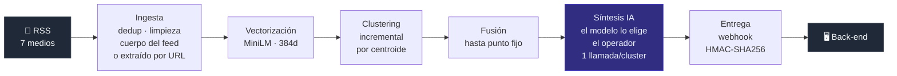

# 🤫 Sin Ruido — Motor de noticias

[](https://github.com/noticias-sin-ruido/motor-noticias/actions/workflows/ci.yml)


[](LICENSE)


**Lee las noticias de varios medios, detecta cuáles cubren el mismo hecho y escribe una síntesis neutral que compara cómo lo contó cada uno.**

El problema no es la falta de información, es el ruido: siete medios publican la misma noticia y ninguno dice exactamente lo mismo. Este motor agrupa esa cobertura por similitud semántica, separa el hecho en sus distintos ángulos y produce, para cada uno, un resumen objetivo más una **comparativa explícita de qué destacó, qué omitió y qué citó cada medio**. La salida se entrega a un back-end por webhook firmado, con tópicos, subtópicos y copy listo para publicar en redes.

Proyecto propio, listo para desplegar, con la entrega al back-end verificada punta a punta contra un receptor real.

**Desde la 1.2.0 viene con una aplicación de escritorio** —la *cabina*— que lo prende, lo apaga y lo opera sin tocar un archivo de configuración. Es opcional: el motor es una API y se puede usar entera con `curl`. Ver [las dos formas de usarlo](#las-dos-formas-de-usarlo).

---

## Índice

**Ver de qué se trata**
· [Cómo funciona](#el-pipeline)
· [Un ejemplo real](#qué-produce-un-ejemplo-real)
· [Qué se prueba sin credenciales](#qué-se-puede-probar-sin-ninguna-credencial)

**Ponerlo a andar**
· [Las dos formas de usarlo](#las-dos-formas-de-usarlo)
· [Con Docker](#1-con-docker--el-camino-corto)
· [Con la cabina](#2-con-la-cabina--la-app-de-escritorio)
· [Sin Docker](#3-sin-docker--para-desarrollar-el-motor)
· [Actualizar](#actualizar-una-instalación-que-ya-anda)

**Operarlo**
· [Elegir los medios](#los-medios-los-elegís-vos)
· [Elegir el modelo de IA](#qué-proveedores-entran)
· [Los 27 endpoints](#api)
· [Token de operador](#token-de-operador)
· [Los logs](#los-logs)

**Entender cómo está hecho**
· [Decisiones de ingeniería](#decisiones-de-ingeniería)
· [Tests y calidad](#tests-y-calidad)
· [Stack](#stack)
· [Toda la documentación](#documentación)

**Lo demás**
· [Estado y qué trajo la 1.2.0](#estado)
· [A quién le confiás tu credencial de IA](#a-quién-le-confiás-tu-credencial-de-ia)
· [Licencia](#licencia)

---

## El pipeline



Corre solo cada 15 minutos con un scheduler embebido, y cada paso tiene además su endpoint manual. **Un paso que falla no frena a los siguientes**: todos son idempotentes, así que la corrida siguiente retoma donde quedó.

Reglas que definen el producto:

- Un cluster necesita **2 medios distintos** para publicarse. Sin dos voces no hay enfoques que comparar.
- La unidad que se publica **no es el cluster sino el ángulo**. Un mismo hecho produce varias síntesis (el hecho, sus consecuencias, las reacciones), porque el clustering agrupa por tema y solo leyendo los textos se los puede separar.
- La descomposición en ángulos **se congela** en la primera síntesis: las re-síntesis actualizan o agregan, nunca reparten de nuevo. Es lo que hace que el `id` sirva como clave de idempotencia para el back-end.

---

## Qué produce: un ejemplo real

Tres medios cubrieron el mismo anuncio de YPF. Hasta el titular difiere entre ellos —US$51.000 millones contra US$50.000 millones— y el motor los unificó igual:

| Medio | Titular original |
|---|---|
| La Nación | *Un proyecto por US$51.000 millones impulsado por YPF solicitó la adhesión al RIGI* |
| TN | *YPF pidió sumarse al RIGI con un proyecto de US$50.000 millones para exportar gas licuado de Vaca Muerta* |
| El Cronista | *YPF presentó su proyecto de GNL al RIGI por u$s 51.000 millones: qué obras abarca* |

Esto es lo que salió, tal cual se lo entregó al back-end:

```json
{
  "version": 1,
  "evento": "sintesis.actualizada",
  "sintesis": {
    "id": 143,
    "titulo": "YPF solicitó la adhesión al RIGI por un proyecto de GNL de 51.000 millones de dólares",
    "resumen": "YPF y sus socios presentaron la solicitud para incluir el proyecto Argentina LNG en el Régimen de Incentivo a las Grandes Inversiones, con una inversión total estimada en 51.000 millones de dólares para producir y exportar gas natural licuado.",
    "puntos_clave": [
      "Inversión estimada en 51.000 millones de dólares",
      "Presentación ante el RIGI",
      "Objetivo de exportar gas natural licuado"
    ],
    "topicos": ["economia", "politica"],
    "subtopicos": ["negocios"],
    "fecha_generacion": "2026-08-14T03:01:53Z",
    "publicacion_redes": {
      "resumen": "YPF solicitó la adhesión al RIGI para su proyecto de gas natural licuado con una inversión de 51.000 millones de dólares.",
      "hashtags": ["ypf", "rigi", "gnl", "economia"]
    }
  },
  "hecho": { "id": 344, "abierto": false },
  "comparativa": [
    {
      "medio": { "id": 2, "nombre": "El Cronista" },
      "destaco": "El monto total de la inversión y la superación de los proyectos ya aprobados en el régimen.",
      "omitio": "Detalles sobre competidores en el mercado de GNL.",
      "cita": "YPF concretó el mayor anuncio de inversión de la historia y presentó a su proyecto Argentina LNG para ser incluido dentro del Régimen de Incentivo a las Grandes Inversiones (RIGI)."
    },
    {
      "medio": { "id": 1, "nombre": "La Nación" },
      "destaco": "El impacto en la balanza comercial y el ingreso de divisas para el país.",
      "omitio": "Menciones específicas sobre competidores como Southern Energy.",
      "cita": "Argentina LNG presentó la solicitud de adhesión al Régimen de Incentivo para Grandes Inversiones (RIGI) para el desarrollo de su proyecto integrado de producción y exportación de gas natural licuado."
    },
    {
      "medio": { "id": 4, "nombre": "TN" },
      "destaco": "Los detalles de la infraestructura de transporte y la competencia con otros proyectos del sector.",
      "omitio": "Cifras detalladas sobre financiamiento inmediato con JP Morgan.",
      "cita": "YPF presentó este jueves ante el Régimen de Incentivo para Grandes Inversiones (RIGI) una iniciativa de exportación de gas natural licuado de Vaca Muerta que demandará una inversión estimada de unos US$50.000 millones."
    }
  ],
  "fuentes": [ "…las 3 notas con medio, título, URL y fecha…" ]
}
```

Lo interesante está en `comparativa`: **el diario de negocios se fijó en el monto, el generalista en el impacto en la balanza comercial y el canal de TV en la infraestructura**. Ninguno mintió; cada uno eligió. Ese es exactamente el producto.

El contrato completo del payload, con la firma HMAC y la semántica de reintentos, está en [specs/webhook_contract.md](specs/webhook_contract.md).

---

## Las dos formas de usarlo

El motor es **una API HTTP y nada más**: no necesita la cabina para funcionar, y
un despliegue en un servidor probablemente no la use nunca. La cabina es una
ventana que habla con esa misma API.

| | **Sólo el motor** | **Motor + cabina** |
|---|---|---|
| Qué es | Contenedores y `curl` | Una app de escritorio |
| Corre en | Linux, macOS, Windows | **Sólo Windows** |
| Hace falta | Docker | Docker Desktop, y clonar el repo |
| Para | Un servidor, un VPS, automatizar | Operar a mano, mirar qué pasa |
| Configurar un medio | `POST /medios` con un JSON | Un formulario que te muestra el sondeo |
| Ver qué se rompió | `docker logs` | Una pestaña con un contador |

**Las dos hablan con el mismo motor y hacen lo mismo.** No hay nada que la
cabina pueda y la API no: la ventana no tiene lógica propia, sólo llama a los
mismos 27 endpoints.

### Cuándo conviene cada una

**Sólo el motor** si lo vas a dejar corriendo en un servidor, si no usás Windows,
o si lo que querés es que produzca y entregue sin que nadie mire.

**Con la cabina** si lo vas a operar vos: decidir qué medios entran, qué modelo
sintetiza, mirar por qué una síntesis no salió. Todo eso se puede hacer con
`curl`, pero leer el sondeo de un feed en un formulario es distinto a leerlo en
un JSON de sesenta líneas.

**La cabina no empaqueta el motor: lo maneja.** Necesita el repo clonado en la
máquina, porque lo que hace es correr `docker compose` contra él. Si no tenés el
repo, no tenés motor — con cabina o sin ella.

---

## Ponerlo a andar

Tres caminos según para qué. Los tres arrancan igual: **clonar el repo y crear
el `.env`.**

```bash
git clone https://github.com/noticias-sin-ruido/motor-noticias.git
cd motor-noticias
cp .env.example .env          # Windows: copy .env.example .env
```

El `.env` de ejemplo **anda tal cual** y no es opcional: el `docker-compose.yml`
lo exige con `env_file`, así que sin él los contenedores no arrancan. Sus
credenciales de base son las mismas que las del compose.

Trae `DATABASE_URL` apuntando a `localhost`, que es lo correcto para correr el
motor **fuera** del contenedor; adentro, el compose la pisa con `db` — el nombre
del servicio en su red. No hay que tocarla en ninguno de los dos casos.

Lo único que hay que completar es la credencial del modelo de IA, y sólo cuando
quieras sintetizar.

---

### 1. Con Docker — el camino corto

Es el recomendado para probarlo y para desplegarlo. **No hace falta Python
instalado**: todo corre adentro del contenedor.

```bash
docker compose up -d
```

Eso levanta Postgres con pgvector, **aplica las migraciones solo** y deja la API
en `http://localhost:8000`. Comprobalo:

```bash
curl localhost:8000/          # {"status":"ok","database":"ok","version":"1.2.0",...}
```

Y ya podés traer noticias de verdad:

```bash
curl -X POST localhost:8000/ingest
curl -X POST localhost:8000/vectorize
curl -X POST localhost:8000/cluster
curl "localhost:8000/clusters?limite=5"
```

> La primera vectorización **baja el modelo de embeddings desde HuggingFace**
> (458 MB, sin cuenta ni token). Tarda unos minutos; las siguientes no.

**El scheduler ya está corriendo**: cada 15 minutos repite ese ciclo solo. Los
`POST` de arriba son el disparo manual del mismo paso.

Sin medios cargados no va a traer nada — ver [Los medios los elegís
vos](#los-medios-los-elegís-vos). Para arrancar con siete de ejemplo:

```bash
docker compose exec app python scripts/seed_medios.py
```

---

### 2. Con la cabina — la app de escritorio

**Sólo Windows**, y necesita el repo clonado (paso de arriba) más **Docker
Desktop corriendo**. La app no trae el motor adentro: lo levanta desde esa
carpeta.

1. **Bajá el instalador** de la [última
   Release](https://github.com/noticias-sin-ruido/motor-noticias/releases) —
   `Sin Ruido_<versión>_x64-setup.exe`.
2. **Windows va a mostrar "Windows protegió su PC"**, porque el instalador no
   está firmado. *Más información → Ejecutar de todas formas*. Firmar un binario
   cuesta cientos de dólares al año y este es un proyecto propio; el aviso es el
   precio de no pagarlo.
3. Instala **por usuario**, así que no pide permisos de administrador.
4. Al abrirla por primera vez te pide **la carpeta del repo** — la del `git
   clone` de arriba, la que tiene el `docker-compose.yml`. Comprueba que lo sea
   antes de aceptarla.
5. Si el motor tiene `API_TOKEN` definido, te lo pide una vez y lo guarda en el
   **Credential Manager de Windows**. Si no lo tiene, no te lo pide: eso lo
   decide el motor, no la app.

Después de eso, **la app levanta y apaga el motor sola**. Muestra en qué anda
mientras arranca (`reconstruyendo → arrancando → migrando → listo`) y tiene siete
pestañas: la lista de trabajo, el feed de lectura, los medios, los modelos, la
actividad, los problemas y los ajustes.

**Al cerrar te pregunta qué hacer con el motor**: detenerlo o dejarlo corriendo.
Es una elección explícita y no un efecto de dónde hiciste clic.

Detalle completo en [app/README.md](app/README.md).

#### Compilarla en vez de bajarla

```powershell
cd app
npm install
npm run tauri build     # deja el .exe en src-tauri/target/release/bundle/nsis/
```

Hace falta Node y la toolchain de Rust con MSVC. Para desarrollarla,
`npm run tauri dev`.

---

### 3. Sin Docker — para desarrollar el motor

Si vas a tocar el código del motor, conviene correrlo fuera del contenedor.

```bash
python -m venv .venv
source .venv/bin/activate                   # Linux / macOS
# .venv\Scripts\activate                    # Windows

pip install -r requirements.txt -r requirements-dev.txt
python -m spacy download es_core_news_md    # el modelo NO viene con la librería

docker compose up -d db                     # sólo Postgres
alembic upgrade head                        # las migraciones a mano
uvicorn src.main:app --reload
```

Chequeo rápido: `python scripts/verify_setup.py`. Guía paso a paso con queries
de verificación: [specs/validacion_manual.md](specs/validacion_manual.md).

---

### Actualizar una instalación que ya anda

```bash
git pull
docker compose up -d --build
```

**El `--build` no es opcional.** Sin él, código nuevo con una migración nueva
deja la base adelantada respecto de la imagen: el `alembic upgrade head` del
arranque no encuentra la revisión y el contenedor entra en bucle de reinicio. Con
la caché caliente cuesta dos segundos.

Con la cabina es lo mismo pero sin escribir nada: `git pull` y reabrir la app,
que reconstruye al arrancar.

**Antes de actualizar, mirá el [CHANGELOG.md](CHANGELOG.md).** Si una versión
pide tocar el `.env` está avisado ahí — la 1.1.0 lo pedía, la 1.2.0 no.

---

### Qué se puede probar sin ninguna credencial

Casi todo el pipeline corre sin registrarse en nada:

| Endpoint | ¿Anda sin credenciales? |
|---|:---:|
| `POST /ingest` — trae noticias reales de 7 medios por RSS | ✅ |
| `POST /vectorize` — genera los embeddings | ✅ |
| `POST /cluster` — agrupa, cierra vencidos y fusiona duplicados | ✅ |
| `GET /search` — búsqueda semántica (KNN de pgvector) | ✅ |
| `GET /clusters` — qué se agrupó con qué | ✅ |
| `GET /` — healthcheck con verificación real de la base | ✅ |
| `POST /synthesize` — síntesis con IA | ❌ pide un modelo dado de alta |
| `POST /deliver` — entrega firmada al back-end | ❌ pide `WEBHOOK_URL` y `WEBHOOK_SECRET` |

O sea: **se puede ver el motor traer noticias de verdad, agruparlas por hecho y responder una búsqueda semántica en unos minutos y sin dar de alta ninguna cuenta.**

Para la síntesis hace falta **un modelo de IA, el que vos elijas**: el que pagás, aquel donde tenés créditos, o uno corriendo en tu propia máquina —en cuyo caso los cuerpos de los artículos no salen de ahí—. Se pone su credencial en `MODELO_API_KEY` y se lo da de alta con `POST /modelos`, que **sondea al proveedor antes de aceptarlo** en vez de registrar lo que le manden — y de paso descubre solo cómo pedirle JSON estructurado.

Sin ningún modelo prendido la síntesis no corre, y el motor lo avisa en cada corrida: **no hay proveedor de reserva**, justamente para que nadie termine mandándole los textos a un tercero que no eligió.

### Los medios los elegís vos

El roster **no viene en el repo**. `scripts/seed_medios.py` carga siete medios argentinos de ejemplo, pero es opcional: lo que manda es `POST /medios`, y la razón es de fondo. Los términos de uso varían muchísimo entre medios —hay quien licencia solo títulos y links, quien pide links de vuelta, quien reserva TDM en su `robots.txt`— y **cuáles son aceptables depende del uso que le des vos**, no de lo que este repo haya decidido por su cuenta.

Por eso el alta **no es un CRUD**: antes de guardar nada sondea los feeds y te informa qué hay del otro lado —cuántos items traen, si traen el cuerpo completo, qué ventana temporal cubren y qué dice el `robots.txt`—. Rechaza lo que está roto (un feed que no responde, no parsea o no trae un item utilizable) y te *avisa* de lo que es criterio tuyo, sin decidirlo por vos. El caso más claro: si un medio publica solo el copete, te lo dice y te deja elegir si activás `extraer_por_url` para ir a buscar el cuerpo a la página — que es cruzar una línea que ese medio trazó.

```bash
curl -X POST localhost:8000/medios -H "Content-Type: application/json" -d '{
  "nombre": "Ámbito", "url_base": "https://www.ambito.com", "pais": "AR",
  "feeds_rss": ["https://www.ambito.com/rss/pages/home.xml"]
}'
```

**Deshabilitar no es borrar.** `PATCH /medios/{id}?activo=false` deja el medio con todas sus noticias, clusters y síntesis; lo único que cambia es que el motor deja de traer sus feeds, y lo volvés a prender cuando quieras. No hay borrado a propósito: se llevaría puestas noticias que quizá ya se entregaron.

Lo que el alta exige del cuerpo, por si el 422 te agarra desprevenido: hasta **20 feeds distintos** (las URLs repetidas se descartan en silencio, no cuentan), **2048 caracteres** por URL, `idioma` como código corto (`es`, `pt-BR`) y `pais` como ISO alfa-2 (`AR`), y `logo_url` obligatoriamente `http` o `https` — un `javascript:` ahí es XSS esperando a la primera interfaz que lo muestre.

Es la **única** credencial que hay que conseguir: el webhook y el SMTP son opcionales y el motor degrada solo —sin webhook configurado las síntesis quedan pendientes en la base y salen apenas se lo configure, en vez de romper el pipeline—.

---

## API

Veintisiete endpoints. Los `POST` del pipeline son disparo manual de cada paso, que además corre solo cada 15 minutos. **Es la misma API que usa la cabina**: la ventana no tiene lógica propia.

| Método | Ruta | Qué hace |
|---|---|---|
| `GET` | `/` | Healthcheck. Devuelve **503** si la base no responde |
| `POST` | `/ingest` | Descarga los feeds, limpia, deduplica y persiste |
| `POST` | `/vectorize` | Vectoriza lo que tenga `embedding IS NULL`. Acepta `?limite=` |
| `POST` | `/cluster` | Cierra vencidos, agrupa las sueltas y fusiona duplicados |
| `POST` | `/synthesize` | Genera las síntesis de los clusters publicables. Acepta `?modelo_id=` |
| `POST` | `/clusters/{id}/synthesize` | Sintetiza **un** cluster puntual. Acepta `?modelo_id=` y `?forzar=`. No gasta una llamada al proveedor si no hay material nuevo (`forzar=true` lo pide igual) ni si el cluster no llega a 2 medios distintos (eso no se fuerza) |
| `POST` | `/deliver` | Barre lo pendiente y lo entrega al back-end. Acepta `?forzar=` |
| `POST` | `/purge` | Borra el cuerpo de las noticias huérfanas vencidas. **Irreversible**. Acepta `?solo_contar=` |
| `GET` | `/search` | Búsqueda semántica. Parámetros `q` y `limite` |
| `GET` | `/clusters` | Clusters con sus noticias y **cuántas síntesis** tiene cada uno. Parámetros `estado` y `limite` |
| `GET` | `/sintesis` | Las síntesis producidas, resumidas. Cursor + `?cluster_id=` y `?entregado=` |
| `GET` | `/sintesis/{id}` | Una síntesis entera: comparativa por medio y fuentes |
| `GET` | `/pipeline` | En qué anda el motor: última corrida, si hay una en curso y las previas |
| `GET` | `/modelos` | Los modelos de IA configurados y cuál se está usando |
| `POST` | `/modelos` | Da de alta un modelo **después de sondearlo** |
| `PATCH` | `/modelos/{id}` | Prende o apaga un modelo. Acepta `?activo=`. **Prender uno apaga a los demás** — pero apagar no lo saca de la cadena de fallback si tiene credencial propia |
| `GET` | `/medios` | Los medios cargados, activos y deshabilitados |
| `POST` | `/medios` | Da de alta un medio **después de sondear sus feeds**. Nace habilitado |
| `PUT` | `/medios/{id}` | Cambia sus datos. Re-sondea si cambian las URLs, y **exige confirmar** si apuntan a un dominio que ese medio no tenía |
| `PATCH` | `/medios/{id}` | Habilita o deshabilita un medio. Acepta `?activo=`. **Deshabilitar no borra** |
| `GET` | `/medios/panel` | Con quién se junta cada medio, y en cuántos clusters queda **solo** — material que no se llega a publicar |
| `GET` | `/entrega` | A dónde se entregan las síntesis. **Exige token siempre** |
| `PATCH` | `/entrega` | Cambia el destino. `null` lo desconfigura y la entrega deja de correr |
| `GET` | `/alertas` | A quién avisa el motor, y cuándo salió el último mail |
| `PATCH` | `/alertas` | Cambia los destinos. Lista vacía = no avisar por mail |
| `POST` | `/alertas/probar` | Manda un mail de prueba. **Un destino configurado no garantiza que salga** |
| `GET` | `/eventos` | Lo que se rompió, una fila por problema con cuántas veces ocurrió |

**Las de `/entrega`, `/alertas` y `/eventos` exigen token siempre**, aun con la API abierta: desviar la entrega o las alertas es redirigir el producto y apagar los avisos, y los eventos son información operativa del despliegue.

Documentación interactiva en `/docs` (OpenAPI, la genera FastAPI).

### Token de operador

**Todos los endpoints son del operador.** El back-end recibe las síntesis por *push* y no consulta nada, así que nada externo consume esta API.

Definí `API_TOKEN` en el entorno y los endpoints piden `Authorization: Bearer <token>` — todos menos la salud (`GET /`, que usa el healthcheck de Docker) y la documentación. **Sin la variable, la API queda abierta y el motor te lo avisa en cada arranque.**

Es opcional a propósito: quien lo corre en su notebook no debería pelearse con una credencial, y cómo se expone el servicio es decisión de quien lo despliega. Pero si lo exponés, ponelo — hay endpoints que **gastan plata por invocación** (`POST /synthesize`), que hacen al motor **golpear todos los feeds con tu identidad** (`POST /ingest`), y que **le entregan tu credencial de IA** a la URL que le indiquen (`POST /modelos`).

### A quién le confiás tu credencial de IA

`POST /modelos` **le manda tu `MODELO_API_KEY` al `base_url` que le indiques** para sondearlo, antes de saber si el proveedor sirve. Por eso un destino público tiene que estar declarado:

```bash
MODELO_HOSTS_PERMITIDOS=api.groq.com,api.openai.com
```

Arranca vacía. Si das de alta un proveedor que no está en la lista, el motor te contesta con la línea exacta que falta en vez de un "no permitido" a secas. **La red interna no hace falta declararla**: un modelo en `localhost:11434` pasa sin lista, que es el caso donde los cuerpos de los artículos no salen de tu máquina.

```bash
# Generá uno
python -c "import secrets; print(secrets.token_urlsafe(32))"

curl -H "Authorization: Bearer $API_TOKEN" http://localhost:8000/modelos
```

El `docker-compose.yml` liga el puerto a `127.0.0.1` y no a `0.0.0.0`, así que por defecto no sale de la máquina. Para exponerlo de verdad: token **y** un proxy con TLS adelante.

### Los logs

El motor escribe a stdout, así que `docker compose logs -f app` alcanza. En `INFO` —el default— cada corrida deja qué hizo cada paso, con qué modelo sintetizó, cuántos tokens costó y **qué porcentaje del ciclo consumió**:

```
2026-08-21 20:53:26-03 INFO  src.main: === Pipeline arranca 21/08 20:53:26 (UTC-3) ===
2026-08-21 20:53:44-03 INFO  src.services.proveedores.gemini: Tokens (gemini-por-defecto): entrada=6583 salida=1457 razonamiento=0
2026-08-21 20:53:51-03 INFO  src.main: === Pipeline termina 21/08 20:53:51 (UTC-3) — 25.1 s — utilización 2.8% del ciclo ===
```

Ese último número es con el que se calibra `INGEST_INTERVAL_MINUTES`: si una corrida normal usa una fracción chica, conviene acortar el ciclo para tener noticias más frescas; si se acerca al techo, alargarlo.

Dos perillas, las dos opcionales:

- `LOG_LEVEL` — `INFO` por defecto. `WARNING` deja solo los problemas. Un valor mal escrito no impide arrancar.
- `LOG_SQL` — el SQL sentencia por sentencia, apagado. Va aparte de `LOG_LEVEL` porque son miles de líneas por ciclo.

La persistencia y la rotación son de Docker, no del motor: el `docker-compose.yml` trae un techo de 10 MB × 5 archivos, que medido son más de tres meses de historia. Un handler de archivo adentro del contenedor sería peor — lo escondería de `docker logs` y, sin rotación, llenaría el disco.

### Qué proveedores entran

**Cualquiera que hable el protocolo de OpenAI**, que es el estándar de hecho: OpenAI, Azure, Groq, OpenRouter, Together, DeepSeek, Mistral, xAI, vLLM, LM Studio, Ollama y el propio Gemini. Se dan de alta cambiando `base_url`, sin tocar código. Gemini además tiene adaptador nativo, que es el único camino a su palanca de razonamiento.

**Limitación conocida — Anthropic.** Se usa con el adaptador `openai_compatible` y `base_url=https://api.anthropic.com/v1`. No hay adaptador nativo, así que no se accede a su salida estructurada (`output_config.format`) ni a `output_config.effort`. Además: está verificado que su capa de compatibilidad **ignora `response_format`**, con lo cual el alta va a caer al modo `tools` — y **eso no está comprobado contra el proveedor real**, porque el proyecto no tuvo una credencial con crédito para probarlo. Si el alta falla, ése es el motivo, y la salida es poner adelante un gateway (LiteLLM, OpenRouter). Ver `specs/roadmap.md`, punto 2.

<details>
<summary><b>Respuestas reales de ejemplo</b></summary>

**`GET /`** — el healthcheck consulta la base de verdad; es lo que usa el `HEALTHCHECK` del Dockerfile para decidir si reinicia el contenedor.

```json
{
  "status": "ok",
  "database": "ok",
  "environment": "production",
  "hora_local": "2026-08-19T13:35:52-03:00"
}
```

**`GET /search?q=YPF presentó su proyecto de gas natural licuado al RIGI&limite=3`**

```json
{
  "status": "ok",
  "consulta": "YPF presentó su proyecto de gas natural licuado al RIGI",
  "cantidad": 3,
  "resultados": [
    {
      "id": 2725,
      "titulo": "YPF pidió sumarse al RIGI con un proyecto de US$50.000 millones para exportar gas licuado de Vaca Muerta",
      "url": "https://tn.com.ar/economia/2026/08/13/ypf-pidio-sumarse-al-rigi-con-un-proyecto-de-us50000-millones…",
      "medio": "TN",
      "cluster_id": 344,
      "fecha_publicacion": "2026-08-13T20:30:24-03:00",
      "similitud": 0.8395
    },
    {
      "id": 2523,
      "titulo": "YPF presentó su proyecto de GNL al RIGI por u$s 51.000 millones: qué obras abarca",
      "url": "https://www.cronista.com/economia-politica/ypf-presenta-su-proyecto-de-gnl-al-rigi-por-us-51000-millones/",
      "medio": "El Cronista",
      "cluster_id": 344,
      "fecha_publicacion": "2026-08-13T21:13:39-03:00",
      "similitud": 0.6558
    },
    {
      "id": 2229,
      "titulo": "YPF cambia: formará una nueva empresa de un negocio que estaba en venta",
      "url": "https://www.cronista.com/negocios/ypf-cambia-formara-una-nueva-empresa-de-un-negocio-que-estaba-en-venta/",
      "medio": "El Cronista",
      "cluster_id": null,
      "fecha_publicacion": "2026-08-12T17:22:38-03:00",
      "similitud": 0.6082
    }
  ]
}
```

Los dos primeros son el mismo hecho y comparten `cluster_id: 344` — el del ejemplo de arriba. El tercero es otra noticia de YPF y quedó **sin cluster**, que es lo correcto.

**`GET /clusters?limite=1`**

```json
{
  "status": "ok",
  "cantidad": 1,
  "clusters": [
    {
      "id": 444,
      "titulo_evento": "Se filtró lo que hizo el novio de Hayden Panettiere cuando le dijeron que la actriz había muerto",
      "estado": "abierto",
      "fecha_creacion": "2026-08-18T14:53:58-03:00",
      "cantidad_noticias": 2,
      "cantidad_sintesis": 0,
      "medios": ["TN"],
      "noticias": [
        { "id": 3952, "medio": "TN", "titulo": "Se filtró lo que hizo el novio de Hayden Panettiere…", "url": "https://tn.com.ar/…" },
        { "id": 3957, "medio": "TN", "titulo": "Brian Hickerson, el novio de Hayden Panettiere, quedó en la mira…", "url": "https://tn.com.ar/…" }
      ]
    }
  ]
}
```

Este cluster tiene **un solo medio**, así que no se publica: le falta la segunda voz —
y por eso mismo `cantidad_sintesis` es `0`.

`cantidad_sintesis` sale de una consulta agrupada sobre los ids que la lista ya
trajo, así que no agrega una consulta por cluster. Está para que quien consume
sepa qué hecho ya está resuelto **sin tener que pedir `GET /sintesis` entera**:
medido desde la app el 07/09/2026, averiguarlo paginando costaba 5 pedidos y
201 ms antes de dibujar una fila, contra 14 ms en uno solo — y lo primero crece
con el histórico mientras que lo segundo no.

</details>

> **Limitación conocida de `/search`.** El modelo es de paráfrasis, así que rinde con consultas redactadas como una oración y se degrada con búsquedas tipo keyword. Medido sobre el mismo corpus: *"YPF presentó su proyecto de gas natural licuado al RIGI"* → **0,84 y acierta**; *"inversión en Vaca Muerta"* → **0,51 y devuelve ruido**, aun teniendo esas notas en la base. Está anotado en el roadmap.

---

## Decisiones de ingeniería

Lo que sigue está **medido contra datos reales**, no estimado. El razonamiento completo de cada decisión —incluido lo que se evaluó y se descartó— está en [specs/change_logs.md](specs/change_logs.md).

**El umbral de similitud se calibró, no se eligió.** Sobre 620 noticias reales: 0,80 → 51 clusters publicables · **0,75 → 57** · 0,70 → 63 pero con falsos positivos. El de fusión bajó de 0,90 a 0,85 después de verlo fallar en producción: dos clusters de un mismo hecho quedaron a 0,8806 y publicaron ángulos solapados.

**Ocho fixes de N+1, encontrados auditando las llamadas reales.** El más grande: crear un cluster con `commit()` en lugar de `flush()` expiraba los atributos de *todos* los objetos cargados en la sesión, y cada lectura posterior disparaba su propio `SELECT`. Medido en una corrida real: **8.345 queries de recarga** sobre 329 noticias sueltas — el 85% de todas las queries del ciclo. El mismo patrón apareció en la vectorización y en el barrido de entrega.

**El copy de redes entra en un tweet, garantizado por código.** X cuenta 280 *caracteres ponderados* y toda URL pesa 23 fijos. Se verificó que el 98% entraba… por casualidad, con un caso fallando por un solo carácter. Ahora una función recorta con presupuesto explícito: primero suelta hashtags, después trunca en límite de palabra. *El prompt pide, el código garantiza* — un `response_schema` no puede expresar restricciones cruzadas entre campos.

**Medir antes de resolver.** Se descartó agregar feeds por sección después de comprobar que aportaban archivo y no cobertura: 151 noticias con antigüedad mediana de 25,5 h, de las cuales **ninguna formó un solo par**. Ocho veces más requests para nada.

**Costo bajo control.** La síntesis es precálculo, no on-demand: una llamada al modelo por cluster. Medido: **US$0,007–0,021 por corrida** sobre 21 clusters publicables.

**Un medio no entra por poder, entra por licencia.** Clarín quedó afuera tras revisar sus términos de uso: la licencia cubre *"títulos y/o links"*, y **retienen el cuerpo del feed a propósito** —0 de 438 ítems—. El extractor por URL existe y podría traerlo; no hacerlo es la decisión. Perfil entró porque su licencia cubre el contenido y pide enlaces de vuelta, que es lo que el motor hace igual.

**El adaptador es código, la configuración es dato.** El enum `Adaptador` está cerrado a propósito: si la fila de la base pudiera nombrar una ruta de import, dar de alta un modelo sería ejecución remota de código. La fila dice *qué* modelo y contra *qué* `base_url`; **la credencial vive en el entorno y nunca en la base**, que se respalda, se dumpea y se lee desde endpoints.

**Un modelo por cluster, y una cadena que no pierde la corrida.** El modelo activo es el default desatendido y encabeza la cadena; detrás van los suplentes **con credencial propia**, en una variable `MODELO_API_KEY_<SUFIJO>` distinta. Compartir la variable del titular es compartir su cuota, así que caer de Gemini a Gemini no resuelve nada cuando lo agotado es la cuota de Gemini — **configurar esa variable es el opt-in**, no hace falta una columna que declare quién es suplente. Dos fallos seguidos sacan a un modelo por lo que queda de la corrida: sin ese cortocircuito, con la cuota agotada cada cluster paga sus tres reintentos con espera creciente antes de caer al siguiente. Un **bloqueo de contenido no cae al siguiente**, y es deliberado: buscar un proveedor que acepte lo que otro rechazó por sus filtros es rodear una negativa de seguridad. Y un `?modelo_id=` explícito **apaga la cadena** — si alguien eligió un modelo, caer en silencio a otro contradice la elección y dejaría en `modelo_usado` una serie histórica que dice que se usó uno que nadie pidió.

**`activo=False` significa "no es el default", no "no se usa".** Un modelo apagado que tenga credencial propia sigue entrando a la cadena como suplente, así que apagarlo no alcanza para dejar de pagarlo: hay que desconfigurar su variable. Está anotado en el roadmap como decisión de producto pendiente, porque el docstring de `PATCH /modelos/{id}` promete que apagar es la marcha atrás y con multimodelo eso dejó de ser cierto.

**El motor tenía logging pero no salida.** Los 16 módulos llaman a `logging` y no había un solo handler: todo `INFO` se descartaba, incluido **el porcentaje del ciclo que consumía cada corrida** — el número con el que se calibra el intervalo del scheduler. Un log que falta no se parece a un error, y por eso sobrevivió a las cinco fases.

---

## Tests y calidad

```bash
pytest                                            # 950 tests del motor
pytest --cov=src --cov-report=term-missing        # cobertura
ruff check src/ tests/ scripts/ alembic/          # lint
alembic check                                     # drift modelo ↔ esquema

cd app && npm run build                           # tipos y bundle del front
cd app/src-tauri && cargo test                    # 86 tests de la cabina
```

**950 tests del motor con 95% de cobertura, más 86 de la cabina.** Los del motor corren sobre SQLite en memoria: la suite no necesita Postgres, ni el modelo de spaCy, ni credencial de IA, ni red. Todo lo externo está mockeado en la frontera.

**Los arreglos se verifican rompiéndolos a propósito.** No alcanza con que un test pase: se muta el código para que la protección falle y se confirma que algún test lo agarra. Encontró tests que probaban nada — uno miraba el código fuente buscando `echo=False` y daba positivo por el **comentario** que explicaba la regla, no por el código; otro comparaba la hora del log contra "ahora" y pasaba en cualquier máquina que ya estuviera en UTC-3, que es justo el único entorno donde no importa.

El CI del motor tiene **dos jobs con objetivos distintos**: uno corre los tests con umbral de cobertura del 80%, y otro levanta un **Postgres + pgvector real** solo para aplicar las migraciones de Alembic. La cabina tiene el suyo, en Windows —`keyring` no compila en Linux—, y un tercer job que **arma el instalador y sólo se dispara al taguear**. Están separados a propósito: sumar Postgres al job de tests no habría agregado cobertura real, pero que una migración rompa contra una base con datos ya pasó una vez.

---

## Stack

| Capa | Herramientas |
|---|---|
| API | FastAPI · Uvicorn · Pydantic v2 |
| Datos | PostgreSQL 16 + **pgvector** · SQLModel / SQLAlchemy 2 · Alembic · psycopg 3 |
| NLP | `paraphrase-multilingual-MiniLM-L12-v2` (384d) · spaCy (NER) · scikit-learn (TF-IDF) |
| IA | **El proveedor lo elige el operador** — adaptador nativo de Gemini, o cualquiera que hable el protocolo de OpenAI |
| Ingesta | feedparser · BeautifulSoup · httpx · tenacity · trafilatura (cuerpo por URL) |
| Infra | Docker Compose · APScheduler · GitHub Actions |
| Cabina | Tauri 2 · React · TypeScript en `strict` · Rust (todo el HTTP sale de acá, el token nunca entra al webview) |

```
src/
├── main.py              # API, scheduler y pipeline encadenado
├── config.py            # settings tipadas, y VERSION: el número de todo el producto
├── database.py          # engine, pool y healthcheck
├── auth.py              # token de operador, opcional y con aviso al arrancar
├── logging_config.py    # el único lugar donde se configura la salida de logs
├── tiempo.py            # se guarda en UTC, se muestra en UTC-3 con el offset
├── models/              # Medio · Noticia · Cluster · Sintesis · PublicacionRedes
│                        # ModeloIA · Corrida · ConfiguracionEntrega
│                        # ConfiguracionAlertas · Evento
└── services/
    ├── ingestion.py     # RSS → limpieza → dedup
    ├── extraccion.py    # cuerpo desde la URL, con robots.txt y piso de caracteres
    ├── vectorization.py # embeddings por lotes
    ├── clustering.py    # agrupamiento incremental + fusión
    ├── categorias.py    # notas sin hecho (horóscopo, opinión): no se agrupan
    ├── preprocessing.py # evidencia para el prompt (TF-IDF + NER)
    ├── synthesis.py     # ángulos, tópicos y copy de redes
    ├── medios.py        # alta de medios: sondeo del feed + validación de destino
    ├── panel_medios.py  # con quién se junta cada medio, y cuándo queda solo
    ├── modelos.py       # alta, sondeo y exclusividad del modelo activo
    ├── proveedores/     # adaptadores: gemini nativo · openai_compatible
    ├── topicos.py       # taxonomía cerrada + sección declarada por el medio
    ├── entrega.py       # a dónde se entrega: la fila, no el .env
    ├── webhook_delivery.py  # payload, firma HMAC y reintentos
    ├── alerts.py        # el envío del aviso por mail
    ├── alertas.py       # a quién se le avisa: la fila, no el .env
    ├── eventos.py       # lo que se rompió, para que se pueda ver sin un log
    ├── corridas.py      # qué hizo cada ciclo
    ├── search.py        # búsqueda semántica y listado
    └── purga.py         # borra el cuerpo de las noticias huérfanas vencidas

app/                     # la cabina (ver app/README.md)
├── src/                 # React: siete pantallas y un solo módulo que cruza el puente
└── src-tauri/           # Rust: HTTP, Docker, el almacén de credenciales y la bandeja
```

**`alerts.py` y `alertas.py` no son lo mismo, y el nombre parecido es
incómodo**: el primero manda el mail, el segundo guarda a quién mandárselo.
Están separados porque el envío tiene que seguir funcionando aunque la base no
responda — que es justo cuando más hace falta avisar.

---

## Documentación

El *por qué* de cada decisión está escrito, no solo el *qué*:

| Documento | Contenido |
|---|---|
| [specs/mission.md](specs/mission.md) | Qué es el proyecto, para quién, y qué NO hace |
| [specs/conventions.md](specs/conventions.md) | Cómo se escribe código acá |
| [specs/roadmap.md](specs/roadmap.md) | Las fases del motor, la app, y el backlog priorizado |
| [specs/change_logs.md](specs/change_logs.md) | Decisiones de diseño: qué se evaluó, qué se descartó y por qué |
| [specs/tech_stack.md](specs/tech_stack.md) | Stack y puntos de quiebre de escalabilidad a vigilar |
| [specs/webhook_contract.md](specs/webhook_contract.md) | Contrato de entrega: payload, firma y reintentos |
| [specs/validacion_manual.md](specs/validacion_manual.md) | Validación manual contra Postgres real |
| [CHANGELOG.md](CHANGELOG.md) | Qué cambió en cada versión, para quien **usa** el motor |
| [app/README.md](app/README.md) | La cabina: cómo está armada, la CSP, el instalador |
| [app/CONTRATO.md](app/CONTRATO.md) | Qué campos de la API consume la cabina, y qué la rompe si cambian |

**`CHANGELOG.md` y `specs/change_logs.md` no son el mismo documento.** El primero
dice qué cambió para quien lo usa; el segundo, qué se evaluó y qué se descartó al
construirlo. Dos lectores distintos.

---

## Estado

**Versión 1.2.0.** Las cinco fases del motor completas, la entrega al back-end
verificada punta a punta contra un receptor real, y una **aplicación de
escritorio** que lo opera.

### Qué trajo la 1.2.0

| | |
|---|---|
| **La cabina** | Una app de escritorio que prende y apaga el motor, y lo opera sin tocar un archivo. Siete pestañas: trabajo, feed, medios, modelos, actividad, problemas y ajustes |
| **Lo que antes era `.env` ahora se configura en caliente** | El destino de entrega y los destinatarios de las alertas viven en la base y se cambian sin redeployar. Las **credenciales** siguen en el entorno a propósito |
| **Un panel de lo que se rompió** | El motor tiene nueve puntos donde avisa, y hasta ahora el único canal era un mail. Ahora quedan registrados y se ven en una pestaña, con un contador que dice cuántas veces pasó cada cosa |
| **Los medios se administran desde la ventana** | Alta con el sondeo del feed a la vista, edición con re-sondeo, y un panel que muestra cuánto material de cada medio **no llega a publicarse** por falta de una segunda voz |

**El contrato con el back-end no se movió**: el payload sigue en su versión `1`.

### Al actualizar desde la 1.1.0

**No hay que tocar nada.** Las dos migraciones —el destino de entrega y los
destinatarios de alertas— **se siembran solas** desde las variables que ya tenías
en el `.env`, así que un despliegue existente sigue funcionando igual. Después
esas dos cosas se configuran desde la app.

Si venís de la **1.0**, mirá el [CHANGELOG.md](CHANGELOG.md): la 1.1.0 sí pedía
dos pasos manuales.

### Lo que la 1.2.0 **no** hace

- **El instalador no está firmado.** Windows va a mostrar "Windows protegió su
  PC" la primera vez. Un certificado son cientos de dólares al año.
- **No se actualiza sola.** Motor y app se numeran juntos, y un updater sólo
  podría entregar la ventana — el motor lo construye Docker desde el repo. Se
  actualiza con `git pull`, que es dos palabras.
- **La cabina es sólo Windows.** El motor no: corre donde corra Docker.

### Qué sigue

El backlog priorizado está en [specs/roadmap.md](specs/roadmap.md). Lo próximo es
que un back-end caído deje de costar material: hoy una síntesis se abandona
después de cinco intentos fallidos, y **un servidor caído una hora cuesta
publicaciones de forma permanente**.

---

## Licencia

Copyright © 2026 Fernando José García.

Distribuido bajo la **[GNU Affero General Public License v3.0](LICENSE)**. En términos prácticos: podés usarlo, estudiarlo, modificarlo y redistribuirlo libremente; si distribuís una versión modificada **o la ofrecés como servicio a través de una red**, tenés que publicar el código fuente de esa versión bajo la misma licencia.

Se eligió AGPL y no una licencia permisiva justamente por lo segundo: este motor se explotaría como servicio, y la GPL común no alcanza ese caso —su obligación se dispara con la distribución de binarios, que en un SaaS nunca ocurre—. La sección 13 de la AGPL es la que cierra ese hueco.

El contenido periodístico que el motor procesa **no** está cubierto por esta licencia: pertenece a cada medio. El motor cita con atribución y enlaza siempre a la nota original.
